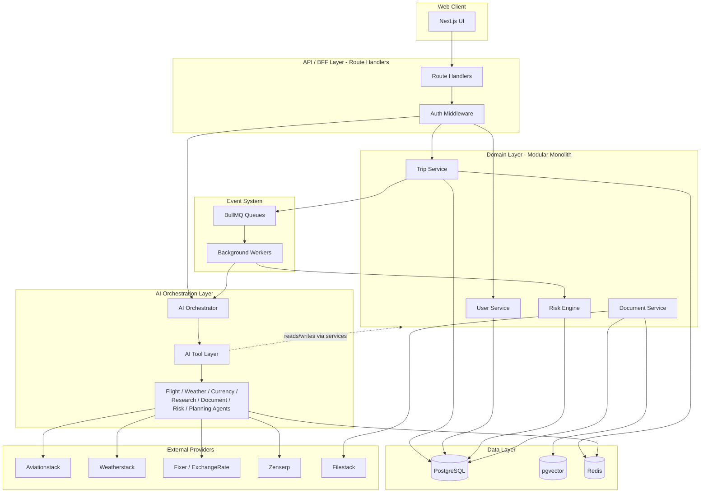
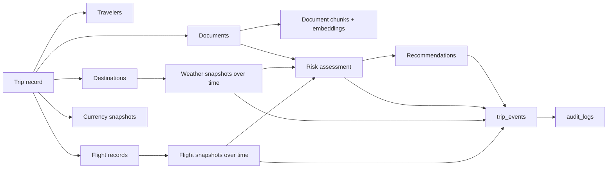
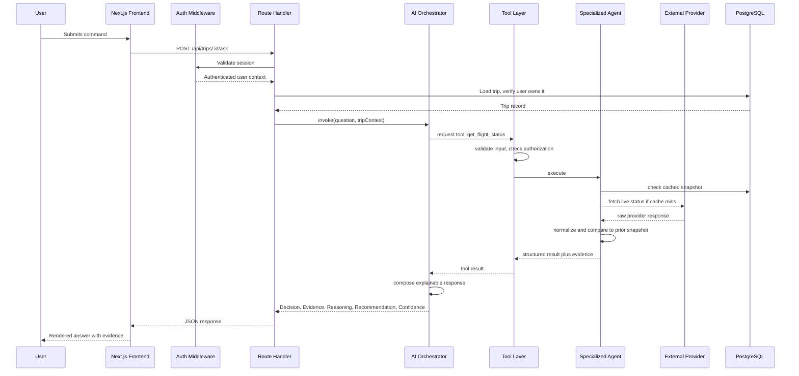
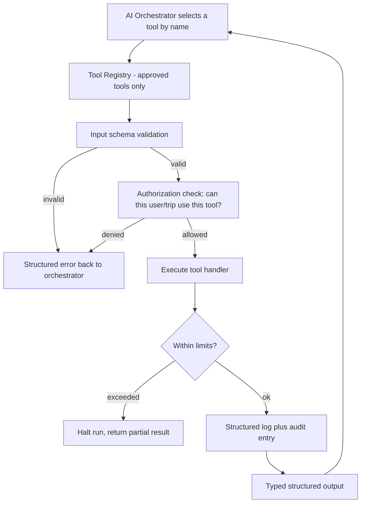
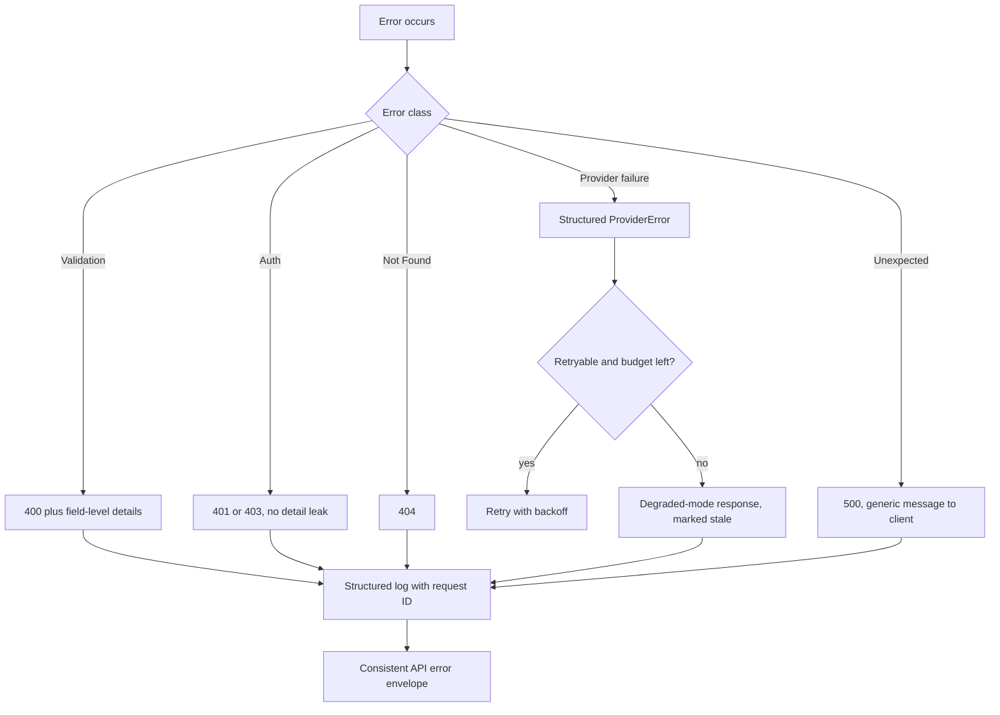
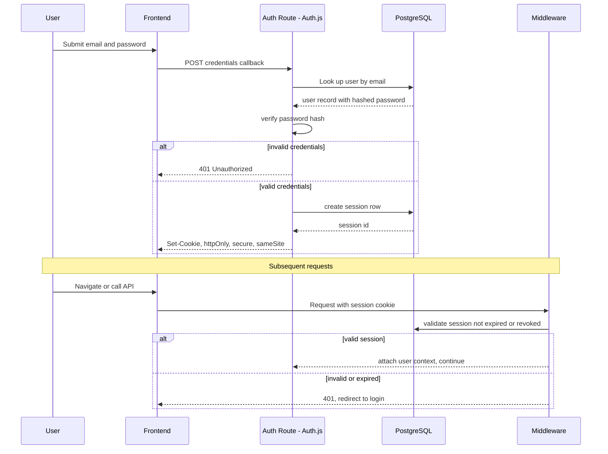
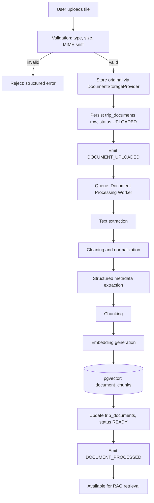

# TripOS — Architecture

## Status: Phase 1 (System Architecture) Complete

---

## 1. Repository Audit Findings (Phase 0)

As of the initial audit (2026-08-24), the repository
`Sertse-bit/TRIPOS-AI-TRAVEL-OPERATIONS-INTELLIGENCE-PLATFORM` contained no
commits, no files, and no branches other than an unborn `main`. This is a
greenfield project — Phase 0 recorded a stack proposal instead of an
audit of existing code, since none existed.

## 2. Technology Stack (Approved 2026-08-24)

| Concern            | Choice                                  | Rationale |
|---------------------|------------------------------------------|-----------|
| Frontend framework  | Next.js (App Router), TypeScript strict  | Unifies frontend + BFF layer; server components reduce client bundle |
| Package manager     | pnpm                                      | Fast installs, disk-efficient, strict dependency resolution |
| Backend             | Next.js Route Handlers, organized as a modular monolith under `src/modules/*` | Avoids premature microservice split; module boundaries allow future extraction without a rewrite |
| Database            | PostgreSQL                                | Relational integrity for trips/travelers/flights/documents; also hosts vector data |
| ORM / migrations    | Prisma                                    | Strong TypeScript type generation, mature migration tooling |
| Vector storage       | `pgvector` extension on the same Postgres instance | Avoids a second database system before there's evidence it's needed |
| Cache                | Redis                                     | Provider response caching, rate-limit bookkeeping |
| Background jobs / events | BullMQ (Redis-backed queues)         | Lightweight; avoids unnecessary distributed infrastructure |
| Auth                 | Auth.js (NextAuth), credentials provider, database-backed sessions via Prisma adapter | See Section 12 — decided now to support the authentication flow design |
| AI orchestration     | Anthropic API (Claude) via a typed tool-calling layer; LangGraph re-evaluated in Phase 9 only if agent handoff complexity justifies it | No orchestration framework adopted until proven necessary |
| Testing              | Vitest (unit/integration), Playwright (E2E) | TypeScript-native, fast |
| Containerization     | Docker + docker-compose                   | `frontend`, `backend` (same Next.js app initially), `postgres`, `redis`, `worker` |
| CI                   | GitHub Actions                            | install → lint → typecheck → unit → integration → build. No deployment target configured (out of scope per brief). |

## 3. Directory Structure (target for Phase 2)

```text
src/
  modules/          # feature-oriented domain modules (trip, flight, weather, currency, document, risk, ai)
  shared/           # cross-cutting types/utilities genuinely shared across modules
  infrastructure/   # db client, redis client, queue setup, logger
  config/           # centralized, validated environment configuration
  database/         # Prisma schema, migrations, seed scripts
  ai/               # tool definitions, orchestrator, agents
  workers/          # background job handlers
  events/           # event definitions, event bus
  integrations/     # provider adapters (Aviationstack, Weatherstack, etc.)
```

## 4. Decisions Log

| Date | Decision |
|------|----------|
| 2026-08-24 | Stack approved as proposed in Phase 0 (no changes requested). |
| 2026-08-24 | External API keys received for 11 providers (8 from the original brief plus ExchangeRate, Mailboxlayer, Marketstack). See `docs/BUILD_PROGRESS.md` for status; real values live only in git-ignored `.env.local`. |
| 2026-08-24 | `ZENSERP_API_KEY` corrected — original value was a duplicate of `AVIATIONSTACK_API_KEY`; replaced with a UUID-format key consistent with Zenserp's real key convention. No longer blocks the Research Agent (Phase 13). |
| 2026-08-24 | `MARKETSTACK_API_KEY` has no mapped use case in TripOS; left configured but unused. |
| 2026-08-24 | Auth strategy decided: Auth.js with credentials provider + Prisma-backed database sessions (not JWT) — chosen so sessions can be revoked server-side immediately, which matters for a "Security Engineer" pass in Phase 4. |
| 2026-08-24 | CI will not configure a real deployment target, per brief Section 31, unless explicitly requested later. |

---

## 5. Bounded Responsibilities & Service Boundaries

TripOS is a modular monolith: one deployable Next.js application, internally
divided into modules with enforced boundaries. The rule that makes this
real rather than nominal:

> **A module may only be used through its public service interface
> (`modules/<name>/index.ts`). No module imports another module's Prisma
> models, internal files, or database rows directly.** Cross-module
> effects happen either through an explicit service call or through a
> published domain event — never through a shared mutable object or a
> direct query into someone else's tables.

This is the mechanism that keeps the "no circular dependencies, no
accidental coupling" goal (final audit, brief Section 36) achievable later,
rather than aspirational.

| Module | Owns | Explicitly does NOT own | Collaborates with |
|---|---|---|---|
| **Trip Service** | `trips`, `travelers`, `destinations`, trip state transitions | Flight/weather retrieval logic; risk computation | Database; invoked by BFF and by AI tools |
| **User Service** | `users`, profile data | Session/auth mechanics (Auth.js owns that) | Database; invoked by BFF |
| **Flight / Weather / Currency Services** | `flight_records`, `weather_snapshots`, `currency_snapshots` and their persistence | Calling the LLM; deciding what the user should do about a change | Provider adapters (via Tool Layer), Database, Redis |
| **Document Service** | `trip_documents`, `document_chunks`, upload/storage orchestration | Embedding model calls, text-extraction library internals | `DocumentStorageProvider`, Database, pgvector |
| **Risk Engine** | `risk_assessments`, the deterministic scoring model | Natural-language explanation generation (delegated to the Risk Agent for prose only) | Database; consumes Flight/Weather/Document snapshots |
| **AI Orchestrator** | Agent selection, tool-call sequencing, execution limits | Direct DB writes (must go through domain services via tools) | Tool Layer only |
| **AI Tool Layer** | Typed tool contracts, input validation, authorization checks, logging | Agent reasoning/prompting | Domain services, provider adapters |
| **Specialized Agents** | Normalizing provider data into domain snapshots; producing structured, evidence-backed output | Inventing values when provider data is unavailable | Provider adapters via Tool Layer only |
| **Integration Layer** | Vendor HTTP/SDK details, retries, caching, circuit breaking | Domain interpretation of the data it fetches | External APIs, Redis |
| **Event System** | Event definitions, publishing, worker dispatch | Business logic itself (workers call back into domain services, they don't reimplement them) | Redis (BullMQ), domain services |

---

## 6. System Container Diagram



---

## 7. Data Flow (Trip Lifecycle)

Distinct from a single request: this is how data accumulates over a trip's
life and feeds the risk/recommendation pipeline.



Snapshots are append-only: a new flight/weather/currency check never
overwrites the previous one. State comparison (Section 9) reads the latest
two snapshots rather than mutating a single row — this is what makes
"only meaningful changes generate alerts" (brief Phase 19) possible.

---

## 8. Request Flow

Example: user asks a question through the command bar.



---

## 9. Event Flow

Example: a flight status change propagating to a user-visible alert.

```mermaid
flowchart LR
    A[Trip Watch scheduled job] --> B[Flight Agent fetches status]
    B --> C{State changed vs
last snapshot?}
    C -- No --> Z[No-op, idempotent]
    C -- Yes --> D[Persist new snapshot]
    D --> E[Emit FLIGHT_UPDATED]
    E --> F[Queue: Risk Analysis Worker]
    F --> G[Risk Engine recomputes score]
    G --> H{Risk changed
meaningfully?}
    H -- No --> Z
    H -- Yes --> I[Persist risk_assessment]
    I --> J[Emit RISK_CHANGED]
    J --> K[Queue: Recommendation Worker]
    K --> L[AI generates explanation from I's evidence]
    L --> M[Persist recommendation]
    M --> N[Emit RECOMMENDATION_CREATED]
    N --> O[Emit NOTIFICATION_REQUIRED]
    O --> P[Notification Worker]
    P --> Q[Deliver to user, record in audit_logs]
```



Idempotency: every event carries the entity id plus the snapshot id that
triggered it, so a worker retry or duplicate delivery is a safe no-op
rather than a duplicate notification (brief Phase 19's explicit
requirement).

---

## 10. AI Tool Flow & Execution Limits



Concrete limits (starting values, tunable in Phase 9 implementation):

- **Max tool calls per orchestration run:** 8
- **Max wall-clock time per run:** 30 seconds
- **Recursion:** agents never call other agents directly — only
  Orchestrator → Agent → Tool. Depth is capped at 1 by construction, not by
  a runtime counter alone.
- **Logging:** every tool call logs request ID, trip ID, tool name,
  duration, and outcome, regardless of success or failure.

---

## 11. Error Propagation



Standard envelopes (finalized in Phase 2, contract fixed now):

```json
// Success
{ "data": { "...": "..." }, "requestId": "req_abc123" }

// Error
{
  "error": {
    "code": "TRIP_NOT_FOUND",
    "message": "Trip not found.",
    "requestId": "req_abc123"
  }
}
```

Client-facing error messages never include stack traces, provider raw
responses, or internal identifiers beyond the request ID — full detail
goes to structured server-side logs only, correlated by that same request
ID.

---

## 12. Authentication Flow



Database-backed sessions (not JWT) were chosen specifically so a session
can be revoked server-side immediately — relevant to the Phase 4 security
pass and worth being able to demonstrate ("log out everywhere" / admin
session revocation) in a portfolio project.

---

## 13. Document-Processing Flow (Architecture Level)

Full pipeline detail (chunking strategy, embedding model, extraction
libraries) belongs to Phase 14–15. This is the system-level shape only.



If extraction fails partway, `trip_documents.status` moves to `FAILED`
with a reason, not silently to `READY` — the brief is explicit that
successful extraction must never be claimed unless it actually happened.

---

## 14. Explicitly Deferred to Later Phases

Phase 1 defines shape and boundaries, not implementation detail. Not
decided here, on purpose:

- Exact retry counts / backoff curve per provider → Phase 6
- Risk scoring formula and factor weights → Phase 16
- Embedding model and chunking parameters → Phase 15
- Exact Redis key/TTL scheme → Phase 6 and Phase 12
- Rate-limit thresholds per route → Phase 4
- Docker service resource limits → Phase 30

---
