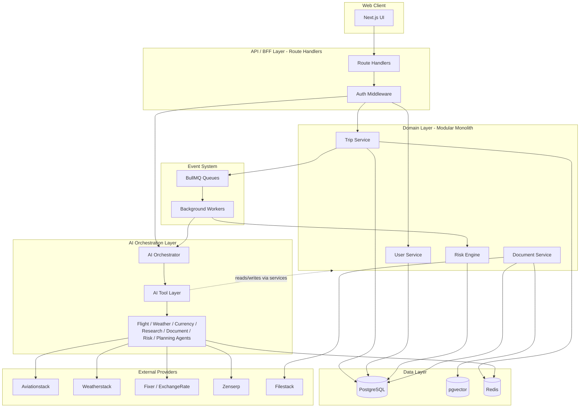
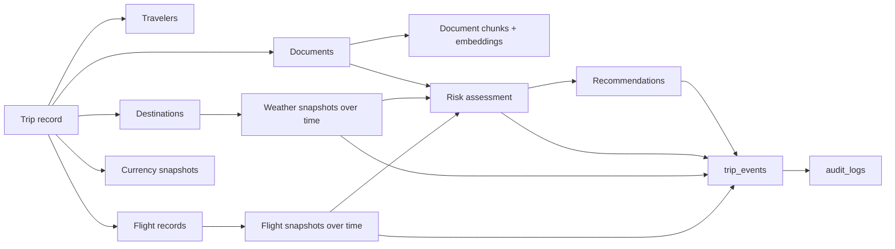
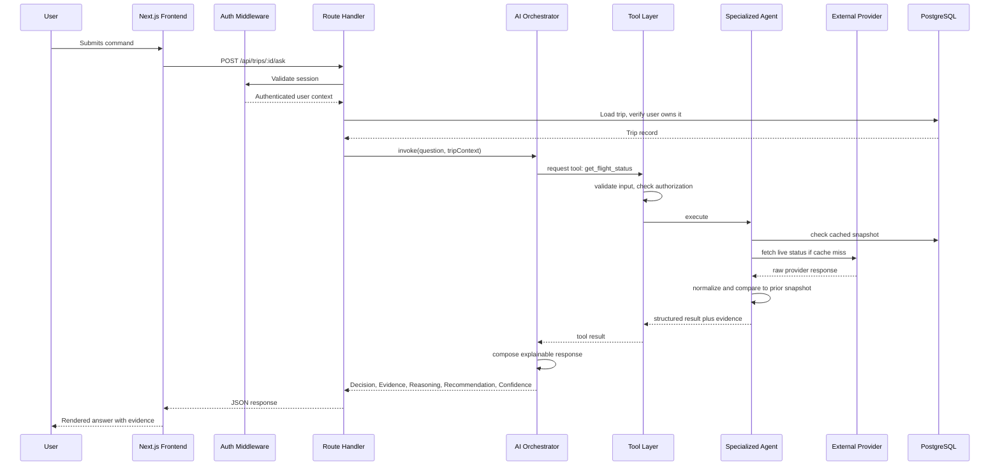
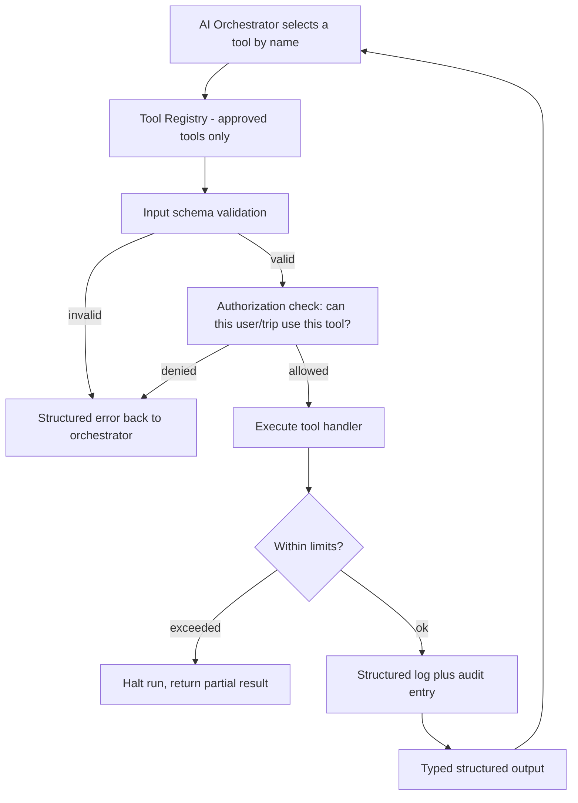
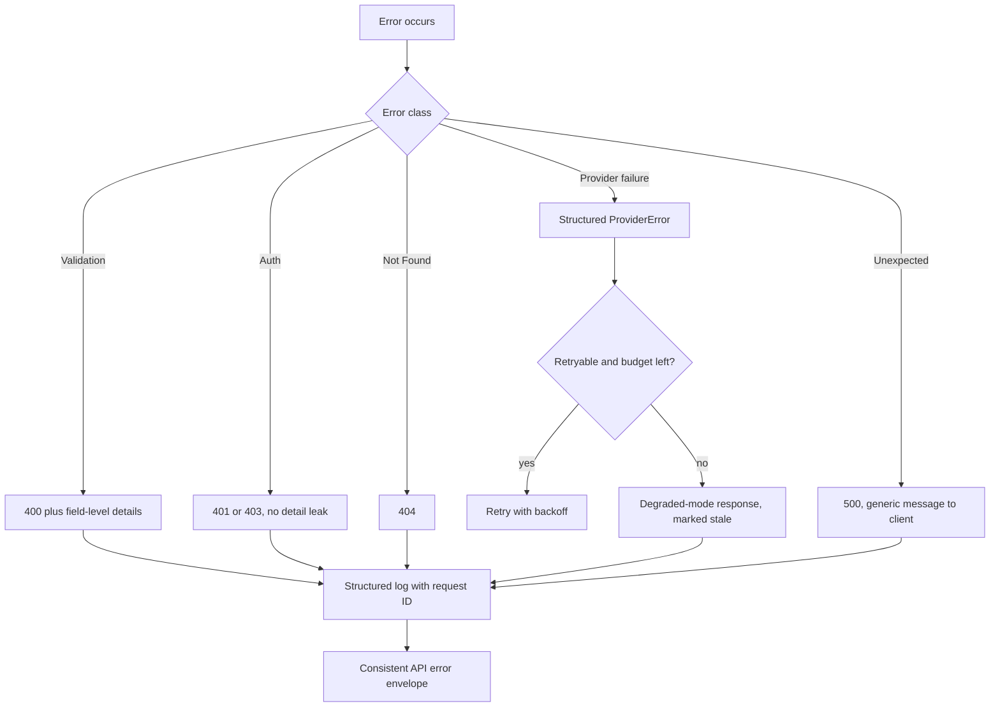
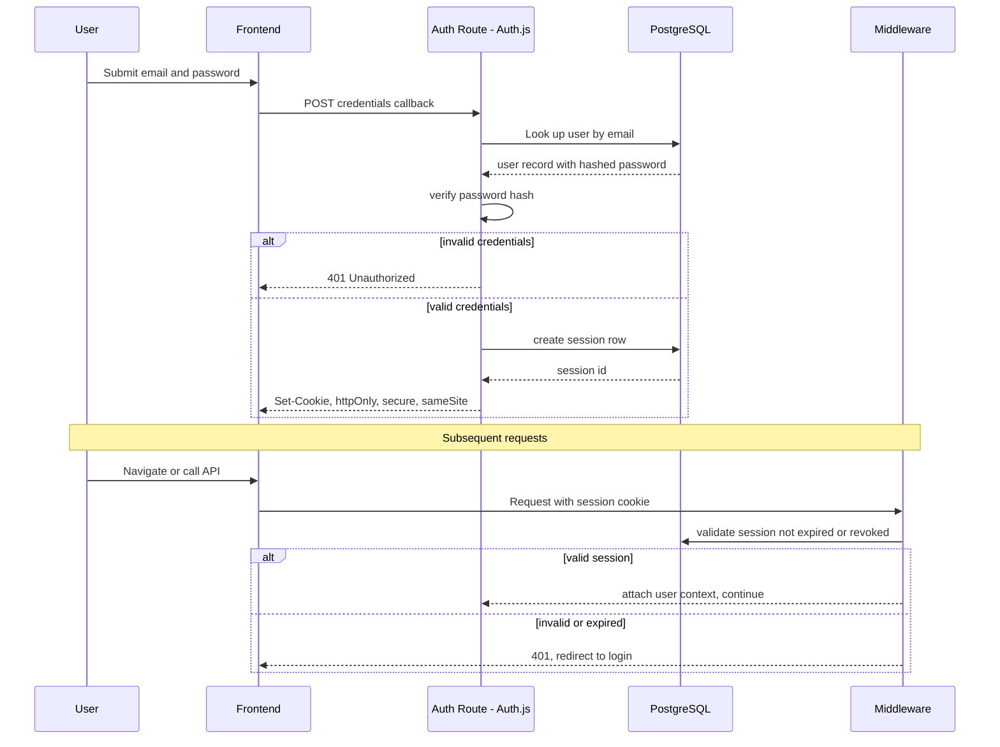
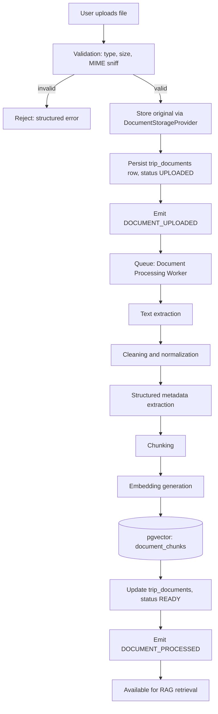

# TripOS — Architecture

## Status: Phase 1 (System Architecture) Complete

---

## 1. Repository Audit Findings (Phase 0)

As of the initial audit (2026-08-24), the repository
`Sertse-bit/TRIPOS-AI-TRAVEL-OPERATIONS-INTELLIGENCE-PLATFORM` contained no
commits, no files, and no branches other than an unborn `main`. This is a
greenfield project — Phase 0 recorded a stack proposal instead of an
audit of existing code, since none existed.

## 2. Technology Stack (Approved 2026-08-24)

| Concern                  | Choice                                                                                                                                 | Rationale                                                                                                          |
| ------------------------ | -------------------------------------------------------------------------------------------------------------------------------------- | ------------------------------------------------------------------------------------------------------------------ |
| Frontend framework       | Next.js (App Router), TypeScript strict                                                                                                | Unifies frontend + BFF layer; server components reduce client bundle                                               |
| Package manager          | pnpm                                                                                                                                   | Fast installs, disk-efficient, strict dependency resolution                                                        |
| Backend                  | Next.js Route Handlers, organized as a modular monolith under `src/modules/*`                                                          | Avoids premature microservice split; module boundaries allow future extraction without a rewrite                   |
| Database                 | PostgreSQL                                                                                                                             | Relational integrity for trips/travelers/flights/documents; also hosts vector data                                 |
| ORM / migrations         | Prisma                                                                                                                                 | Strong TypeScript type generation, mature migration tooling                                                        |
| Vector storage           | `pgvector` extension on the same Postgres instance                                                                                     | Avoids a second database system before there's evidence it's needed                                                |
| Cache                    | Redis                                                                                                                                  | Provider response caching, rate-limit bookkeeping                                                                  |
| Background jobs / events | BullMQ (Redis-backed queues)                                                                                                           | Lightweight; avoids unnecessary distributed infrastructure                                                         |
| Auth                     | Auth.js (NextAuth), credentials provider, database-backed sessions via Prisma adapter                                                  | See Section 12 — decided now to support the authentication flow design                                             |
| AI orchestration         | Anthropic API (Claude) via a typed tool-calling layer; LangGraph re-evaluated in Phase 9 only if agent handoff complexity justifies it | No orchestration framework adopted until proven necessary                                                          |
| Testing                  | Vitest (unit/integration), Playwright (E2E)                                                                                            | TypeScript-native, fast                                                                                            |
| Containerization         | Docker + docker-compose                                                                                                                | `frontend`, `backend` (same Next.js app initially), `postgres`, `redis`, `worker`                                  |
| CI                       | GitHub Actions                                                                                                                         | install → lint → typecheck → unit → integration → build. No deployment target configured (out of scope per brief). |

## 3. Directory Structure (target for Phase 2)

```text
src/
  modules/          # feature-oriented domain modules (trip, flight, weather, currency, document, risk, ai)
  shared/           # cross-cutting types/utilities genuinely shared across modules
  infrastructure/   # db client, redis client, queue setup, logger
  config/           # centralized, validated environment configuration
  database/         # Prisma schema, migrations, seed scripts
  ai/               # tool definitions, orchestrator, agents
  workers/          # background job handlers
  events/           # event definitions, event bus
  integrations/     # provider adapters (Aviationstack, Weatherstack, etc.)
```

## 4. Decisions Log

| Date       | Decision                                                                                                                                                                                                                                                                                                                                                                                                                                                                                                                                                                                                                                  |
| ---------- | ----------------------------------------------------------------------------------------------------------------------------------------------------------------------------------------------------------------------------------------------------------------------------------------------------------------------------------------------------------------------------------------------------------------------------------------------------------------------------------------------------------------------------------------------------------------------------------------------------------------------------------------- |
| 2026-08-24 | Stack approved as proposed in Phase 0 (no changes requested).                                                                                                                                                                                                                                                                                                                                                                                                                                                                                                                                                                             |
| 2026-08-24 | External API keys received for 11 providers (8 from the original brief plus ExchangeRate, Mailboxlayer, Marketstack). See `docs/BUILD_PROGRESS.md` for status; real values live only in git-ignored `.env.local`.                                                                                                                                                                                                                                                                                                                                                                                                                         |
| 2026-08-24 | `ZENSERP_API_KEY` corrected — original value was a duplicate of `AVIATIONSTACK_API_KEY`; replaced with a UUID-format key consistent with Zenserp's real key convention. No longer blocks the Research Agent (Phase 13).                                                                                                                                                                                                                                                                                                                                                                                                                   |
| 2026-08-24 | `MARKETSTACK_API_KEY` has no mapped use case in TripOS; left configured but unused.                                                                                                                                                                                                                                                                                                                                                                                                                                                                                                                                                       |
| 2026-08-24 | Auth strategy decided: Auth.js with credentials provider + Prisma-backed database sessions (not JWT) — chosen so sessions can be revoked server-side immediately, which matters for a "Security Engineer" pass in Phase 4.                                                                                                                                                                                                                                                                                                                                                                                                                |
| 2026-08-25 | Refined in Phase 4: implementing session handling directly rather than through the `next-auth`/Auth.js library. The Phase 3 `sessions` table deliberately stores a token _hash_, not the raw token, which doesn't match Auth.js's official Prisma adapter contract (`sessionToken`, raw). Bridging that would mean either redesigning the table to match the library or writing a custom adapter — both more machinery than a single credentials-based flow needs. Hand-rolling keeps the mechanism fully transparent and consistent with the schema already built. Database-backed, revocable sessions — the actual goal — is unchanged. |
| 2026-08-24 | CI will not configure a real deployment target, per brief Section 31, unless explicitly requested later.                                                                                                                                                                                                                                                                                                                                                                                                                                                                                                                                  |

---

## 5. Bounded Responsibilities & Service Boundaries

TripOS is a modular monolith: one deployable Next.js application, internally
divided into modules with enforced boundaries. The rule that makes this
real rather than nominal:

> **A module may only be used through its public service interface
> (`modules/<name>/index.ts`). No module imports another module's Prisma
> models, internal files, or database rows directly.** Cross-module
> effects happen either through an explicit service call or through a
> published domain event — never through a shared mutable object or a
> direct query into someone else's tables.

This is the mechanism that keeps the "no circular dependencies, no
accidental coupling" goal (final audit, brief Section 36) achievable later,
rather than aspirational.

| Module                                   | Owns                                                                                          | Explicitly does NOT own                                                                     | Collaborates with                                    |
| ---------------------------------------- | --------------------------------------------------------------------------------------------- | ------------------------------------------------------------------------------------------- | ---------------------------------------------------- |
| **Trip Service**                         | `trips`, `travelers`, `destinations`, trip state transitions                                  | Flight/weather retrieval logic; risk computation                                            | Database; invoked by BFF and by AI tools             |
| **User Service**                         | `users`, profile data                                                                         | Session/auth mechanics (Auth.js owns that)                                                  | Database; invoked by BFF                             |
| **Flight / Weather / Currency Services** | `flight_records`, `weather_snapshots`, `currency_snapshots` and their persistence             | Calling the LLM; deciding what the user should do about a change                            | Provider adapters (via Tool Layer), Database, Redis  |
| **Document Service**                     | `trip_documents`, `document_chunks`, upload/storage orchestration                             | Embedding model calls, text-extraction library internals                                    | `DocumentStorageProvider`, Database, pgvector        |
| **Risk Engine**                          | `risk_assessments`, the deterministic scoring model                                           | Natural-language explanation generation (delegated to the Risk Agent for prose only)        | Database; consumes Flight/Weather/Document snapshots |
| **AI Orchestrator**                      | Agent selection, tool-call sequencing, execution limits                                       | Direct DB writes (must go through domain services via tools)                                | Tool Layer only                                      |
| **AI Tool Layer**                        | Typed tool contracts, input validation, authorization checks, logging                         | Agent reasoning/prompting                                                                   | Domain services, provider adapters                   |
| **Specialized Agents**                   | Normalizing provider data into domain snapshots; producing structured, evidence-backed output | Inventing values when provider data is unavailable                                          | Provider adapters via Tool Layer only                |
| **Integration Layer**                    | Vendor HTTP/SDK details, retries, caching, circuit breaking                                   | Domain interpretation of the data it fetches                                                | External APIs, Redis                                 |
| **Event System**                         | Event definitions, publishing, worker dispatch                                                | Business logic itself (workers call back into domain services, they don't reimplement them) | Redis (BullMQ), domain services                      |

---

## 6. System Container Diagram


```mermaid
flowchart TB
    subgraph Client["Web Client"]
        UI[Next.js UI]
    end

    subgraph BFF["API / BFF Layer - Route Handlers"]
        AuthMW[Auth Middleware]
        Router[Route Handlers]
    end

    subgraph Domain["Domain Layer - Modular Monolith"]
        TripSvc[Trip Service]
        UserSvc[User Service]
        RiskSvc[Risk Engine]
        DocSvc[Document Service]
    end

    subgraph AI["AI Orchestration Layer"]
        Orchestrator[AI Orchestrator]
        ToolLayer[AI Tool Layer]
        Agents[Flight / Weather / Currency /
Research / Document / Risk / Planning Agents]
    end

    subgraph Data["Data Layer"]
        PG[(PostgreSQL)]
        VectorDB[(pgvector)]
        Redis[(Redis)]
    end

    subgraph Events["Event System"]
        Queue[BullMQ Queues]
        Workers[Background Workers]
    end

    subgraph External["External Providers"]
        Aviation[Aviationstack]
        Weather[Weatherstack]
        Currency[Fixer / ExchangeRate]
        Search[Zenserp]
        Storage[Filestack]
    end

    UI --> Router
    Router --> AuthMW
    AuthMW --> TripSvc
    AuthMW --> UserSvc
    AuthMW --> Orchestrator

    Orchestrator --> ToolLayer
    ToolLayer --> Agents
    Agents --> Aviation
    Agents --> Weather
    Agents --> Currency
    Agents --> Search
    DocSvc --> Storage

    TripSvc --> PG
    UserSvc --> PG
    RiskSvc --> PG
    DocSvc --> PG
    DocSvc --> VectorDB
    ToolLayer -.reads/writes via services.-> Domain

    TripSvc --> Redis
    Agents --> Redis

    TripSvc --> Queue
    Queue --> Workers
    Workers --> RiskSvc
    Workers --> Orchestrator
```

---

## 7. Data Flow (Trip Lifecycle)

Distinct from a single request: this is how data accumulates over a trip's
life and feeds the risk/recommendation pipeline.


```mermaid
flowchart LR
    Trip[Trip record] --> Traveler[Travelers]
    Trip --> Flight[Flight records]
    Trip --> Dest[Destinations]
    Trip --> Doc[Documents]
    Flight --> FlightSnap[Flight snapshots over time]
    Dest --> WeatherSnap[Weather snapshots over time]
    Trip --> CurrencySnap[Currency snapshots]
    Doc --> Chunks[Document chunks + embeddings]
    FlightSnap --> Risk[Risk assessment]
    WeatherSnap --> Risk
    Doc --> Risk
    Risk --> Rec[Recommendations]
    FlightSnap --> Events[trip_events]
    WeatherSnap --> Events
    Risk --> Events
    Rec --> Events
    Events --> Audit[audit_logs]
```

Snapshots are append-only: a new flight/weather/currency check never
overwrites the previous one. State comparison (Section 9) reads the latest
two snapshots rather than mutating a single row — this is what makes
"only meaningful changes generate alerts" (brief Phase 19) possible.

---

## 8. Request Flow

Example: user asks a question through the command bar.


```mermaid
sequenceDiagram
    participant U as User
    participant FE as Next.js Frontend
    participant MW as Auth Middleware
    participant API as Route Handler
    participant ORCH as AI Orchestrator
    participant TOOL as Tool Layer
    participant AGENT as Specialized Agent
    participant EXT as External Provider
    participant DB as PostgreSQL

    U->>FE: Submits command
    FE->>API: POST /api/trips/:id/ask
    API->>MW: Validate session
    MW-->>API: Authenticated user context
    API->>DB: Load trip, verify user owns it
    DB-->>API: Trip record
    API->>ORCH: invoke(question, tripContext)
    ORCH->>TOOL: request tool: get_flight_status
    TOOL->>TOOL: validate input, check authorization
    TOOL->>AGENT: execute
    AGENT->>DB: check cached snapshot
    AGENT->>EXT: fetch live status if cache miss
    EXT-->>AGENT: raw provider response
    AGENT->>AGENT: normalize and compare to prior snapshot
    AGENT-->>TOOL: structured result plus evidence
    TOOL-->>ORCH: tool result
    ORCH->>ORCH: compose explainable response
    ORCH-->>API: Decision, Evidence, Reasoning, Recommendation, Confidence
    API-->>FE: JSON response
    FE-->>U: Rendered answer with evidence
```

---

## 9. Event Flow

Example: a flight status change propagating to a user-visible alert.

```mermaid
flowchart LR
    A[Trip Watch scheduled job\nPhase 19: runDueWatches()] --> B[Flight Agent fetches status]
    B --> C{State changed vs
last snapshot?}
    C -- No --> Z[No-op, idempotent]
    C -- Yes --> D[Persist new snapshot]
    D --> E[Emit FLIGHT_UPDATED]
    E --> F[Queue: Risk Analysis Worker]
    F --> G[Risk Engine recomputes score]
    G --> H{Risk changed
meaningfully?}
    H -- No --> Z
    H -- Yes --> I[Persist risk_assessment]
    I --> J[Emit RISK_CHANGED]
    J --> K[Queue: Recommendation Worker]
    K --> L[AI generates explanation from I's evidence]
    L --> M[Persist recommendation]
    M --> N[Emit RECOMMENDATION_CREATED]
    N --> O[Emit NOTIFICATION_REQUIRED]
    O --> P[Notification Worker]
    P --> Q[Deliver to user, record in audit_logs]
```

Idempotency: every event carries the entity id plus the snapshot id that
triggered it, so a worker retry or duplicate delivery is a safe no-op
rather than a duplicate notification (brief Phase 19's explicit
requirement).

---

## 10. AI Tool Flow & Execution Limits


```mermaid
flowchart TB
    Orchestrator[AI Orchestrator selects a tool by name] --> Registry[Tool Registry - approved tools only]
    Registry --> Validate[Input schema validation]
    Validate -->|invalid| Reject[Structured error back to orchestrator]
    Validate -->|valid| AuthZ[Authorization check: can this user/trip use this tool?]
    AuthZ -->|denied| Reject
    AuthZ -->|allowed| Exec[Execute tool handler]
    Exec --> Bound{Within limits?}
    Bound -->|exceeded| Halt[Halt run, return partial result]
    Bound -->|ok| Log[Structured log plus audit entry]
    Log --> Result[Typed structured output]
    Result --> Orchestrator
```

Concrete limits (starting values, tunable in Phase 9 implementation):

- **Max tool calls per orchestration run:** 8
- **Max wall-clock time per run:** 30 seconds
- **Recursion:** agents never call other agents directly — only
  Orchestrator → Agent → Tool. Depth is capped at 1 by construction, not by
  a runtime counter alone.
- **Logging:** every tool call logs request ID, trip ID, tool name,
  duration, and outcome, regardless of success or failure.

---

## 11. Error Propagation


```mermaid
flowchart TB
    E[Error occurs] --> Class{Error class}
    Class -->|Validation| V[400 plus field-level details]
    Class -->|Auth| A[401 or 403, no detail leak]
    Class -->|Not Found| N[404]
    Class -->|Provider failure| PFail[Structured ProviderError]
    PFail --> Retry{Retryable and budget left?}
    Retry -->|yes| Backoff[Retry with backoff]
    Retry -->|no| Degrade[Degraded-mode response, marked stale]
    Class -->|Unexpected| Unexp[500, generic message to client]
    V --> Log[Structured log with request ID]
    A --> Log
    N --> Log
    Degrade --> Log
    Unexp --> Log
    Log --> Envelope[Consistent API error envelope]
```

Standard envelopes (finalized in Phase 2, contract fixed now):

```json
// Success
{ "data": { "...": "..." }, "requestId": "req_abc123" }

// Error
{
  "error": {
    "code": "TRIP_NOT_FOUND",
    "message": "Trip not found.",
    "requestId": "req_abc123"
  }
}
```

Client-facing error messages never include stack traces, provider raw
responses, or internal identifiers beyond the request ID — full detail
goes to structured server-side logs only, correlated by that same request
ID.

---

## 12. Authentication Flow


```mermaid
sequenceDiagram
    participant U as User
    participant FE as Frontend
    participant API as Auth Route - Auth.js
    participant DB as PostgreSQL
    participant MW as Middleware

    U->>FE: Submit email and password
    FE->>API: POST credentials callback
    API->>DB: Look up user by email
    DB-->>API: user record with hashed password
    API->>API: verify password hash
    alt invalid credentials
        API-->>FE: 401 Unauthorized
    else valid credentials
        API->>DB: create session row
        DB-->>API: session id
        API-->>FE: Set-Cookie, httpOnly, secure, sameSite
    end

    Note over U,MW: Subsequent requests
    U->>FE: Navigate or call API
    FE->>MW: Request with session cookie
    MW->>DB: validate session not expired or revoked
    alt valid session
        MW-->>API: attach user context, continue
    else invalid or expired
        MW-->>FE: 401, redirect to login
    end
```

Database-backed sessions (not JWT) were chosen specifically so a session
can be revoked server-side immediately — relevant to the Phase 4 security
pass and worth being able to demonstrate ("log out everywhere" / admin
session revocation) in a portfolio project.

---

## 13. Document-Processing Flow (Architecture Level)

Full pipeline detail (chunking strategy, embedding model, extraction
libraries) belongs to Phase 14–15. This is the system-level shape only.


```mermaid
flowchart TB
    U[User uploads file] --> V[Validation: type, size, MIME sniff]
    V -->|invalid| R[Reject: structured error]
    V -->|valid| S[Store original via DocumentStorageProvider]
    S --> P[Persist trip_documents row, status UPLOADED]
    P --> EV1[Emit DOCUMENT_UPLOADED]
    EV1 --> Q[Queue: Document Processing Worker]
    Q --> EXTRACT[Text extraction]
    EXTRACT --> CLEAN[Cleaning and normalization]
    CLEAN --> META[Structured metadata extraction]
    META --> CHUNK[Chunking]
    CHUNK --> EMBED[Embedding generation]
    EMBED --> VSTORE[(pgvector: document_chunks)]
    VSTORE --> DONE[Update trip_documents, status READY]
    DONE --> EV2[Emit DOCUMENT_PROCESSED]
    EV2 --> RAG[Available for RAG retrieval]
```

If extraction fails partway, `trip_documents.status` moves to `FAILED`
with a reason, not silently to `READY` — the brief is explicit that
successful extraction must never be claimed unless it actually happened.

---

## 14. Explicitly Deferred to Later Phases

Phase 1 defines shape and boundaries, not implementation detail. Not
decided here, on purpose:

- Exact retry counts / backoff curve per provider → Phase 6
- Risk scoring formula and factor weights → Phase 16 (decided; see Section 18)
- Embedding model and chunking parameters → Phase 15
- Exact Redis key/TTL scheme → Phase 6 and Phase 12
- Rate-limit thresholds per route → Phase 4
- Docker service resource limits → Phase 30

---

## 15. Trip Digital Twin (Phase 7)

The concept sketched in Section 7's diagram is now a real domain service
(`src/modules/trip/trip-service.ts`), not just a database row:

```text
Trip
├── Travelers        addTravelerToTrip()
├── Destinations     addDestinationToTrip()
├── Flights          addFlightToTrip()          (scheduled info only —
│                                                 live status is Phase 10)
├── Documents        attachDocumentToTrip()     (relationship only —
│                                                 the pipeline is Phase 14)
├── Weather snapshots  recordWeatherSnapshot()  (storage only — fetching
├── Currency snapshots recordCurrencySnapshot()  is Phase 11/12)
├── Events           recordTripEvent() — immutable, every operation above writes one
├── Risks / Recommendations   risk_assessments written by the Risk Engine
│                             (Phase 16, Section 18); recommendations
│                             written by the Risk Agent and linked to
│                             the assessment they explain (Phase 17,
│                             Section 19)
└── Operational state  calculateOperationalState() — deterministic, real data only
```

**Closes a gap deliberately left open in Phase 4**: `docs/SECURITY.md`
noted "resource-level (row) authorization... deliberately not built yet."
Every mutating trip operation now calls `requireOwnedTrip()`, which
resolves ownership and throws the identical `NotFoundError` whether the
trip doesn't exist or belongs to someone else — verified live: a
non-owner gets `404`, not `403`, so a trip ID can't be used as an
enumeration oracle to learn which IDs are valid.

**Operational state is deliberately simple** — INCOMPLETE (nothing set up
yet) / ON_TRACK / ATTENTION_NEEDED (a flight's latest snapshot is
DELAYED) / DISRUPTED (CANCELLED or DIVERTED) — derived only from data
that genuinely exists right now. This is not a preview of Phase 16's
weighted deterministic risk score; it's the simpler precursor Phase 16
extends, not replaces.

---

## 16. Document Intelligence (Phase 14)

Section 13's pipeline is now implemented in
`src/modules/trip/document-service.ts`, with three decisions worth
recording:

- **Extraction runs inline in the request, not on a queue.** Queue and
  worker infrastructure is Phase 18's deliverable; pretending it exists
  earlier would be dishonest architecture. `processTripDocument` is
  isolated so moving it behind a worker later is wiring, not a rewrite.
- **A document is READY only when extraction genuinely produced text.**
  Images (no OCR in this build), text-free scans, and corrupt files all
  end FAILED with a stored reason. `trip_documents.extracted_text` holds
  the recovered body; `extracted_metadata` holds deterministic,
  evidence-backed facts (flight numbers, dates, booking references) —
  extracted by regex-with-evidence, never guessed by an LLM.
- **The storage provider stays the Phase 5 swap point.** With
  `FILESTACK_API_KEY` configured, real Filestack uploads are attempted;
  without it, the documented mock adapter is used and says so. The
  sandbox cannot reach filestack.com, so the adapter is tested at the
  HTTP boundary and service tests mock the provider.

The trip page's document surface follows the Section 5 boundary rule in
the usual way: a client island posts multipart FormData to the route and
then calls `router.refresh()`, while the list itself stays server-rendered
from the trip service. One rendering-boundary rule turned up while wiring
it up and is worth recording: a server component may **render** an export
from a `"use client"` module (StatusBadge), but it may not **call** one
(every export of a client module is a client reference). Pure helpers used
by both sides therefore live in `src/components/tone.ts`, which carries no
directive. No static check in this project catches that class of mistake —
it only shows up as a 500 at request time.

Phase 15 (RAG) reads `trip_documents.extracted_text` to chunk and embed,
rather than re-parsing the original file.

---

## 17. RAG Retrieval (Phase 15)

Section 13's pipeline now ends in real vector search, and three decisions
from that phase are worth recording:

- **The vector store is Postgres, genuinely.** pgvector was missing in
  this environment and had to be built from source; `document_chunks`
  is a real `vector(1024)` column with an HNSW cosine index, and ranking
  is the `<=>` operator rather than a similarity computed in application
  code. Nothing here simulates vector search.
- **The embedding provider's weakness is reported, not smoothed over.**
  With no `VOYAGE_API_KEY`, retrieval runs on a local feature-hashing
  embedder that computes real vectors but measures shared vocabulary
  rather than meaning. Every retrieval result carries the provider name
  and a `semantic` flag, and the UI states it — the alternative, a
  quietly degraded search that looks identical to a real one, is exactly
  the kind of invented capability this project refuses.
- **Scoping and ranking happen in one statement.** `searchChunksByVector`
  applies the trip filter in the same SQL that orders by similarity, so
  a cross-trip leak can't come from a missing or reordered authorization
  step. Retrieval returns stored chunks with their similarity; composing
  an answer from them is Phase 17's job, not this layer's.

---

## 18. Risk Engine (Phase 16)

Section 14 deferred "risk scoring formula and factor weights" here on
purpose. The decision, and three things it taught while being built:

```text
riskScore (0-100)  =  Σ  ratio_i × weight_i      weights sum to exactly 100

  flightDisruption      40   worst real flight status drives it
  weatherSeverity       20   scales from documented wind/rain floors
  scheduleProximity     15   rises as departure approaches (72h horizon)
  itineraryCompleteness 15   destinations and travelers present
  documentReadiness     10   extracted and indexed

severity:  ≥60 CRITICAL · ≥35 HIGH · ≥15 MEDIUM · else LOW
```

- **The scoring model is a pure function and cannot become a model's
  opinion.** `risk-scoring.ts` takes already-gathered inputs and
  returns a score — no DB, no clock, no network, no LLM. That is what
  makes "the same inputs always give the same score" a property rather
  than a promise. Generating the _explanation_ of a score in prose is
  Phase 17's job, and only that.
- **Absence of data is a first-class result, not zero risk.** A factor
  with nothing behind it scores 0, is flagged `dataAvailable: false`,
  and has its weight counted into `dataGaps`. `confidence` is defined as
  the share of factors that actually had data, so it describes evidence
  coverage and never pretends to be a probability that something bad
  will happen. A trip nothing is known about is confidently _unknown_,
  which is the truthful answer.
- **A cancelled flight floors severity at CRITICAL.** Weighted alone it
  scores 40/100 and reads "HIGH", because the other four factors really
  are quiet — but a cancellation means the trip cannot proceed, which is
  categorically different from "several things are slightly elevated".
  Same reasoning `calculateOperationalState()` already applies with its
  DISRUPTED label in Section 15.
- **Thresholds have floors, and that was a bug first.** Weather scaling
  began as `wind / 80` with no lower bound, which rated an 8 kph breeze
  at 0.1 risk. Unit tests caught it; the fix scales between documented
  floors and ceilings instead. A risk engine that cannot say "nothing is
  wrong" will eventually invent something that is.
- **The module reads the Trip Service's public interface only.** The
  engine is its own module, so the data it needs (latest status per
  flight, latest weather per destination, which documents are indexed)
  arrives through new Trip Service functions rather than through another
  module's repositories — the same boundary rule Section 15 established.

`calculateOperationalState()` from Section 15 is untouched: it remains
the coarse ON_TRACK/DISRUPTED label, and this is the weighted score
underneath it.

---

## 19. Explainable AI (Phase 17)

Section 18 established that the score is the domain's. This phase draws
the line that follows from it: **the model writes prose, never numbers.**
The Risk Agent reads a stored assessment through `get_trip_risk` and
returns Decision / Evidence / Reasoning / Recommendation / Confidence.
Two constraints are enforced in code rather than requested in a prompt:

```text
  explanation.evidence[].factor  ∈  assessment.factors[].key   → else reject
  min(modelConfidence, assessment.confidence)                   → capped
```

- **Grounding is checkable; prompting is not.** There's no code-level way
  to verify an LLM's prose only used retrieved facts, which is why the
  Research Agent (Section 9) has to settle for a `hasEvidence` flag it
  then sanity-checks. Risk explanation can do better: because Phase 16's
  factors are a known, finite, persisted set, every citation can be
  validated against it. An explanation citing a factor that doesn't exist
  is rejected and the offending names are reported.
- **Confidence is capped by evidence coverage, in code.** Phase 16
  defines an assessment's confidence as the share of factors that had
  real data. Letting a model report a higher number than that would let
  prose outrank the data under it, so the cap is applied here and
  disclosed in the UI rather than hidden.
- **Anthropic deliberately has no mock adapter.** Every other provider in
  Section 6 degrades to a documented mock. A generated _explanation of a
  risk score_ cannot: the mock would have to invent exactly the prose
  this phase exists to ground in real evidence. So an unconfigured key
  produces a clear refusal and the risk score stays fully available —
  verified live: the explain routes return a clean `502 PROVIDER_ERROR`
  naming the missing key, store nothing, and the deterministic endpoint
  keeps working.
- **The link back to the score is set by the caller.** `riskAssessmentId`
  is taken from the row the calling code actually read, never from model
  output, so a recommendation can never reference a score that was
  never computed.
- **`search_trip_knowledge` now searches.** It carried a hardcoded
  "not yet implemented" response from before Phase 15 existed. It calls
  the real pgvector retrieval and forwards `semantic` /
  `embeddingProvider`, so a lexical fallback match can't be reported as
  a semantic one — the same rule Section 17 established at the service
  layer, now enforced at the tool boundary too.

---

## 20. Trip Monitor (Phase 18)

Section 9's event chain is now real code, minus the two pieces that
would otherwise have to be faked:

```text
monitorTrip(tripId, ownerId)
  │
  ├─ for each flight      → processFlightStatusUpdate()  (Phase 10)
  ├─ for each destination → processWeatherUpdate()       (Phase 11)
  │     each failure captured as skipped: true, never as "unchanged"
  │
  ├─ assessTripRisk()  unconditionally  (Phase 16)
  ├─ compare to the previously stored assessment
  │     └─ no meaningful change → stop. no event, no alert.
  │
  └─ meaningful? → createDeduplicatedNotification()
        INSERT ... ON CONFLICT (dedupe_key) DO NOTHING
        0 rows returned  →  already reported  →  no duplicate
```

- **Idempotency is the database's job, not a check-then-act race.**
  `trip_events.dedupe_key` already carries a UNIQUE index from Phase 3.
  Claiming the key with `ON CONFLICT DO NOTHING` makes "already
  reported" an atomic outcome, so two concurrent passes cannot both see
  the gap and each notify. A read-then-write guard would have the same
  shape as the guarantee and none of the strength.
- **The key is the condition, not the snapshot or the entity.**
  `risk_alert:<trip>:<severity>:<direction>`. Snapshot-keyed would
  re-alert on every poll of an unchanged flight; trip-keyed would
  swallow an escalation, which is the worst moment to be silent.
- **Severity band, not raw score, is the alerting signal.** 62 → 64
  inside HIGH is not news. This is Section 18's "missing data is a
  result, not zero risk" applied to alerting: the same discipline that
  stops the score inventing risk stops the monitor inventing urgency.
- **A failed check is its own result.** Captured per entity so one bad
  provider can't abort the pass, and surfaced as `skipped` so a broken
  check is never indistinguishable from a healthy one.
- **Two things are honestly not built.** There is no BullMQ worker:
  a durable queue needs a long-running process that a Next.js route
  handler is not, and pretending otherwise would be a worse lie than the
  omission. The Phase 17 explanation step is not invoked either, because
  a monitoring pass must not depend on an optional key being present.
- **Notifications are linked to the event that authorised them.**
  `notifications.trip_event_id` existed with no writer; the event is now
  inserted first and the notification references it, which is the order
  the schema implies.

---

## 21. Trip Watch (Phase 19)

Section 9's chain begins with "Trip Watch scheduled job" and Section 20
built everything after it. This phase builds the scheduling itself — and
only that, because Phase 18's monitor is already the pass worth
scheduling.

```text
runDueWatches({ ownerId? , now? , limit? })
  │
  ├─ SELECT enabled watches WHERE next_run_at <= COALESCE($now, now())   [ JOIN trips ]
  │
  └─ for each candidate, sequentially:
       UPDATE trip_watches SET next_run_at = now() + interval
        WHERE trip_id = $1 AND enabled AND next_run_at <= now()
       │
       ├─ 0 rows  → someone else claimed it → "already-claimed", nothing runs
       └─ 1 row   → trip COMPLETED/CANCELLED ? disable watch + WATCH_PAUSED
                                  : monitorTrip(tripId, ownerId, { minimumAlertSeverity })
                                       ├─ ok      → last_run_at, last_error = null
                                       └─ throws  → last_error, next attempt one interval out
```

- **Claim-then-run is the whole design.** A "check if due, then run"
  sweep is a race with a shape that looks like a guarantee and is not.
  Advancing `next_run_at` in the same `UPDATE` that reads it means the
  database decides who runs the pass, and a duplicate sweep is a no-op
  rather than a duplicate set of provider calls. Tested by racing two
  real sweeps against the real database, not asserted from the code's
  shape.
- **One clock, and it is Postgres's.** `next_run_at` is written with
  `now()`; reading it into a JavaScript `Date` truncates microseconds
  _downwards_, so a watch created microseconds earlier can compare as
  not-yet-due against a clock that is nominally the same. The first
  version of this phase did that and flaked under parallel test load.
  Every comparison now happens inside SQL via
  `COALESCE($n::timestamptz, now())`, with the injectable `now` kept for
  tests moving time forward.
- **A watch is the only thing that makes monitoring automatic.** No trip
  is watched implicitly, so no provider spend happens because a trip
  exists. Enabling (or re-enabling) a watch makes it due immediately — a
  "start watching" control that does nothing for an hour reads as
  broken; every pass after that schedules one full interval out.
- **Being interrupted is the traveller's decision, not the monitor's.**
  `alert_min_severity` is a floor on notification only: the pass still
  checks everything and still stores the assessment, and the result
  reports `below-threshold` separately from `already-reported`. That
  distinction is why "you asked not to be told" can never render as
  "nothing happened". The default `MEDIUM` is behaviour-preserving,
  because a meaningful change cannot occur while the score is still LOW.
- **A finished trip stops being watched, and says so.** COMPLETED and
  CANCELLED trips have no live flights or weather; the sweep disables
  the watch and appends one `WATCH_PAUSED` event to the trip's own
  history, deduped on the fact itself. Polling a finished trip forever
  would be provider spend with no possible information in it.
- **Still no worker, and the honest reason is unchanged.** A durable
  queue needs a long-running process a route handler is not. What this
  phase establishes is that the dispatch layer is safe to call from
  anywhere, any number of times, so adding a scheduler changes _who
  calls it_, not what happens.

---

## 22. Itinerary & Budget (Phase 20)

The seventh specialized agent, and the first one whose output is
_persisted_ rather than returned to a caller.

```text
POST /api/trips/[id]/itinerary/plan
  │
  ├─ requireAuth → runPlanningAgentForUser(tripId, userId)
  │    ├─ getTrip + getTripDestinations        (ownership checked twice)
  │    ├─ no dates / no destinations / no Anthropic key ─▶ refuse BEFORE any LLM call
  │    ├─ runAgent(planningAgent, …)           (5 read tools, 8-call / 30s budget)
  │    ├─ groundPlanItems(plan, trip, destinations)   [code, fail-closed]
  │    │      every date inside the trip range; every city one of the
  │    │      trip's own destinations; no duplicate day; end after start
  │    └─ replaceGeneratedPlan(...) ── DELETE prior AI rows + INSERT new
  │           in ONE transaction; USER rows untouched
  └─ { days, rationale, assumptions, itemsCreated, aiItemsReplaced, budget }

GET /api/trips/[id]/itinerary
  └─ listTripItinerary → items + computeItineraryBudgetStatus(trip, items)
         totalsByCurrency  = pure sums of stored values (no provider)
         converted total   = only if EVERY rate resolves; otherwise
                             converted: null + a named conversionError
                             (never a partial sum shown as "the total")
```

- **Module boundary.** A new `itinerary` module owns items and budget
  validation. It reaches the trip module only through public seams
  (`getTrip`, `getTripDestinations`, `emitTripEvent`, `updateTripBudget`);
  `TripRecord`/`DestinationRecord` are re-exported by the trip service so
  no other module imports trip repositories. The itinerary module's own
  repository is internal to it.
- **Two writers, one table.** `source USER` (the item API) and
  `source AI_PLANNER` (the planner) are mutually exclusive by
  construction: a re-plan replaces exactly the AI rows, so regenerating
  a schedule can never destroy something the traveler typed.
- **The model writes no numbers.** Its output schema has no cost field,
  and the budget it reasons about is fed to it through the read-only
  `get_trip_itinerary` tool, computed deterministically. Costs are the
  traveler's recorded input; unknown costs are counted
  (`itemsWithoutCost`), never assumed to be zero.
- **Events**: `ITINERARY_ITEM_ADDED` / `ITINERARY_ITEM_UPDATED` /
  `ITINERARY_ITEM_REMOVED` / `ITINERARY_PLANNED` / `TRIP_BUDGET_UPDATED`,
  all appended to the trip's own history through `emitTripEvent` — the
  planner's runs are therefore auditable like everything else in Phase
  7's append-only log.
- **API**: `GET|POST /api/trips/[id]/itinerary`, `PATCH|DELETE
/api/trips/[id]/itinerary/[itemId]`, `POST
/api/trips/[id]/itinerary/plan`, `PUT|DELETE /api/trips/[id]/budget` —
  all through `withApiHandler`, so the envelope and request ID are
  uniform with every other route.

---

## 23. Command Bar (Phase 22)

Section 8's request flow, implemented — the path it named back in Phase
1, `POST /api/trips/[id]/ask`, is now the route the trip page's command
bar posts to.

```text
POST /api/trips/[id]/ask  { command: 1–500 chars }
  │
  ├─ withApiHandler → requireAuth → body validated (Zod)
  ├─ runCommandForUser(tripId, userId, command)
  │    ├─ getTrip                       (ownership BEFORE any LLM call)
  │    ├─ command re-validated, destinations pre-fetched into the message
  │    ├─ no Anthropic key ─▶ ProviderError, 502, before any model call
  │    ├─ runAgent(commandAgent, …)     (11 read tools, 8 calls / 30s / 50k)
  │    │       └─ records a real OrchestratorToolCall[] trail
  │    ├─ assertEvidenceWasInvoked(evidence, trail)   [code, fail-closed]
  │    └─ { decision, evidence, reasoningSummary, recommendationText,
  │          confidence, dataGaps, toolCalls, toolCallsUsed,
  │          durationMs, tokensUsed }
  └─ trip page renders decision / action / reasoning / evidence chips /
     “couldn’t be verified” gaps / confidence / the real ✓✗ call trail
```

- **Read-only, structurally.** The agent's allowed tools are exactly the
  registry's 11 reads; the two action tools are excluded and a test pins
  it. A question can never mutate a trip as a side effect.
- **Provenance is code-checked.** Each `evidence[]` entry must name a
  tool the orchestrator actually invoked in that run — an invoked-but-
  failed call counts (the answer may honestly report the failure), a
  never-called tool is a `ValidationError`. The model does not get to
  author its own audit trail; `runAgent` records it.
- **The UI shows the same trail** the check ran against: every tool call
  with ✓/✗, plus the run's real duration and call count from the API
  response — no invented "AI thinking" affordances.
- **Non-owner and unknown-trip requests are 404s**, never 500s: server
  components load trip data through `orNotFound()`, which translates the
  trip module's `NotFoundError` into Next's `notFound()` — the same
  semantics the API has had since Phase 7.
- **No key, no fake answer.** Without `ANTHROPIC_API_KEY` the endpoint
  returns the same honest `502 PROVIDER_ERROR` as the risk, research,
  and planning agents, and the page renders the bar disabled with that
  explanation.

---

## 24. System Observability (Phase 23)

The panel answers one question — _what has this deployment actually
done?_ — from exactly three real sources, and nothing else:

```text
GET /api/observability   (requireAuth, deployment-level)
  ├─ infrastructure: database / Redis pinged NOW, latency measured
  ├─ providers:      union of providerAvailability ∪ api_health rows
  │                  ∪ in-process circuit entries, sorted; per provider:
  │                  { configured, health | null, circuit | null }
  └─ summary:        { providers, configured, operational, degraded,
                       down, neverExercised }
```

- **Sources of truth:** `api_health` rows (written by the resilience
  layer on every real provider attempt since Phase 6), the in-process
  circuit breaker's live states (`getAllCircuitStates()`, additive),
  and `providerAvailability` env checks. Health and circuit are
  reported as separate, independent signals — never merged into one
  synthesized status.
- **“Never exercised” ≠ healthy.** A provider with no recorded attempt
  renders `health: null` and the UI says “never exercised”. The panel
  refuses to show OPERATIONAL for a provider that has not been called —
  the same no-fabrication rule that governs provider adapters applies
  to the observability surface itself.
- **No metrics pipeline, no fake graphs.** There are no CPU/memory
  charts because nothing records them; the page's “How to read this
  panel” card states this explicitly. The Refresh button performs a
  real re-check (`router.refresh()`), not a simulated polling timer.
- **Scope:** deployment-level, not owner-scoped — the report exposes
  provider health metadata only, never credentials or user data.
- **Test hermeticity (found via this phase):** `vitest.setup.ts` now
  assigns the test database, Redis URL, and fake provider keys
  unconditionally. `??=` silently let Vitest's `.env.local` preload win,
  running the whole suite against the dev database with real keys.
  Tests are hermetic by construction now; `TEST_DATABASE_URL` remains
  the escape hatch for CI.

## 25. Audit Trail (Phase 24)

`audit_logs` (present in the schema since Phase 3, unwritten until now)
answers _who did what, when, and under which request?_

```text
writes (only after a state change actually committed)
  USER      recordUserAction     → fire-and-forget, failure logged
  AI_AGENT  recordAgentDelivery  → fire-and-forget, persisted only
  SYSTEM    recordSystemAction   → awaited (watch sweeps)

reads (ownership never derived from the audit rows)
  GET /api/trips/[id]/audit  → getTrip() first  → listAuditLogsForTrips
  GET /api/audit             → listUserTrips()  → listAuditLogsForUser
  /trips/audit page + "Recent activity" card on the trip page
```

- **Append-only, no foreign keys.** Audit rows outlive the entities they
  describe (and agent/system actors are not `users` rows), so nothing
  cascades away history. The cost is that ownership cannot be joined —
  both readers are handed trip ids that the _trip_ module already verified
  belong to the caller.
- **Scope is explicit and asymmetric.** A trip's trail is strictly
  trip-scoped (matched on `metadata->>'tripId'` or the trip as the entity).
  The user-wide stream additionally includes the caller's own `USER` rows
  by actor id, which is the only way account-level actions
  (`auth.register`, `auth.login`, `notification.read`) appear at all —
  they name no trip, and recording them into invisibility would be
  pointless. A test pins both halves of that rule.
- **Honest attribution.** A watch sweep runs with nobody behind it, so
  it is written as `SYSTEM` with a null actor rather than attributed to
  the trip's owner. Nothing is written for an attempt that changed no
  state (an unchanged flight, a non-significant weather reading, a
  refused LLM call), so the log cannot claim work that did not happen.
- **One id, three places.** `requestId` is the same value the API
  envelope (`withApiHandler`) and the structured log line carry. A cron
  worker with no HTTP request writes `null` — the schema's own convention.- **Failure policy is stated, not hidden.** The USER/AGENT writers are
  fire-and-forget by design (a lost audit row is a smaller failure than a
  mutation that appears to have failed after committing) and log at warn;
  the SYSTEM writer is awaited because a sweep is already background work
  whose own report must not outpace its audit row.

## 26. Accessibility (Phase 25)

The theme is a token system whose scale **inverts** in dark mode
(`--sand-50` is the lightest surface in light mode and the darkest in
dark). That made two classes of failure possible at once, and both were
real:

```text
text-navy-950 dark:text-navy-100    light: #0c1a2e on #f7f4ef  15.9:1  ok
                                    dark:  #1b2738 on #1a1714   1.06:1  INVISIBLE
text-sand-500                      light: #a08a70 on #fcfaf6   3.17:1  fails AA
text-sand-400                      light: #c0ac93 on #ffffff   2.20:1  fails AA
```

- **Tokens carry a contrast contract, and a test enforces it.**
  `src/app/accessibility.test.ts` parses both token maps out of
  `globals.css`, computes WCAG relative luminance/contrast in-process, and
  checks every `text-*` palette class found in the source against the
  surfaces that theme renders text on. It also fails on any palette class
  whose token `globals.css` never declares — Tailwind silently generates
  nothing for those, so `bg-navy-50` was a styled-looking dead class.
- **Chip colours are checked pairwise** (the eight `StatusBadge`
  foreground/background pairs) rather than against the neutral surfaces,
  because a tinted chip is a surface only its own badge text sits on.
- **Semantics are structural, not per-page.** The root layout owns the
  skip link and it is the first focusable element; each shell's `<main>`
  owns `id="main-content"`; the nav owns one `aria-current="page"`
  computed by longest-prefix match in a pure module (`nav-links.ts`) so the
  rule is unit-tested rather than eyeballed. Shells are deliberately not
  client components — only the nav is an island.- **What a static check cannot see is stated, not implied:** no browser
  audit ran (no Chrome in this sandbox), so focus order, tab traps, and
  screen-reader output are unverified; gradients and `text-white` on
  coloured buttons are outside the scan; dynamic class names are
  unreachable by a literal scan.

## 27. Testing (Phase 27)

Testing follows "what breaks quietly", not a coverage percentage. The
suite (Vitest, real Postgres/Redis for module tests) now pins the three
contracts whose violation would be silent:

```text
withApiHandler        → the API's observable contract: one envelope,
                        request id in body + x-request-id header, AppError
                        → status mapping, zod → 400 + issues, unknown →
                        generic 500 that leaks nothing but carries the id
tone.ts mappings      → a wrong mapping paints a DOWN provider green;
                        every Prisma enum value is pinned, unknown values
                        are pinned to neutral so new ones force a decision
itinerary validation  → the cost/currency pair rule guards the budget
                        guarantee before the service can see a broken pair
session token hashing → the raw token exists only in the cookie value;
                        the sessions row sees only the SHA-256 digest
```

- **No skipped tests, ever** — a test that cannot run honestly is deleted
  or recorded as a limitation. Playwright E2E (the other stack-table
  choice) is the standing example: written but never executable in this
  sandbox, so it is documented as absent rather than committed green.
- **What is not tested is stated:** repository CRUD is exercised through
  the service tests rather than duplicated file-for-file; the WebGL
  effect's pixels cannot be asserted without a browser (its plumbing is);
  and coverage tooling is deliberately not installed until a number would
  change a decision.

## 28. Failure Testing (Phase 28)

Failure paths are classified by what their wrong version would do, and
the two gates get opposite treatment on purpose:

```text
requireAuth / requireSession   absent or deleted-account session → 401 /
                               redirect WITH an encoded returnTo
                               database outage → propagates (500 / error
                               boundary). An outage is not a logout.
audit writes                  USER + AI_AGENT: fire-and-forget, never
                               reject into a caller whose mutation already
                               committed; logged at warn with the requestId
                               SYSTEM (watch sweeps): awaited, because a
                               sweep report must not outrun its own row
signup deliverability          only a real "undeliverable" verdict stops
                               registration; provider trouble fails open
```

- **The rule behind the asymmetry:** the writer that describes something
  that already happened must never fail the thing it describes; the
  writer that backs a claim the caller is about to make must be awaited.
  Both directions are now pinned by tests, so neither can drift into the
  other silently.
- **Testability is a design property, not an afterthought:** the signup
  deliverability policy lives in `modules/auth/email-deliverability.ts`
  rather than inside the route, so it is tested through the real
  function instead of a mocked-out registration.
- **Stubbed at the true boundary:** these tests break the provider call
  or the insert, never the database the whole suite shares, and they
  assert the caller's contract (return value, rejection, log line) rather
  than an internal call count alone.
