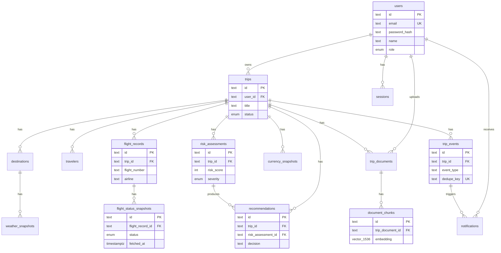

# TripOS — Database

## Status: Phase 3 (Database Architecture) Complete

Source of truth for the schema is `prisma/schema.prisma`. This document
explains the design and, importantly, how it was actually verified.

## A note on verification methodology

`prisma generate` / `migrate` / `validate` could not be run in the sandbox
this was built in. Prisma's CLI fetches a schema-engine binary from
`binaries.prisma.sh` at runtime — confirmed on both Prisma 7 and Prisma 6,
so this isn't a version quirk — and that domain isn't in this sandbox's
network allowlist (the same restriction that blocks the travel provider
APIs; see `docs/BUILD_PROGRESS.md` Phase 0).

This is a **sandbox-only** limitation. Any normal dev machine, GitHub
Actions runner, or Docker build has standard internet access and will run
`pnpm db:generate` / `pnpm db:migrate` normally.

To still verify the actual relational design for real rather than writing
it on faith, the schema was hand-translated into equivalent DDL and
applied directly to a live local PostgreSQL 16 + pgvector 0.6.0 instance
(installed in-sandbox via `apt`, from the allowed Ubuntu mirrors — no
external network dependency). That verification covered:

- All 17 tables, 8 enum types, and every index created without error.
- A full realistic insert chain: user → trip → destination → flight
  record → two append-only flight status snapshots → weather snapshot →
  currency snapshot → document → document chunk (with a real 1536-dimension
  vector, not a stub) → risk assessment → recommendation → trip event.
- The `trip_events.dedupe_key` unique constraint **correctly rejected** a
  duplicate insert — proving the idempotency design in
  `docs/ARCHITECTURE.md` Section 9 actually holds at the database level,
  not just on paper.
- A real pgvector cosine-distance similarity query (`<=>` operator) against
  the HNSW index, which executed and returned a result.
- `ON DELETE CASCADE`: deleting a trip correctly removed every dependent
  row (destinations, flights, snapshots, documents, chunks, risk
  assessments, recommendations, events) while leaving the owning user
  intact.

`prisma/seed.ts` is written against the real Prisma Client API (the
correct, intended path for any environment where `prisma generate` can
run) but was not itself executed end-to-end here, since it depends on
client generation. The equivalent data shape it produces **was** verified
via the raw SQL pass above.

## Entity-Relationship Diagram

`audit_logs` and `api_health` are intentionally standalone (not
FK-linked): audit entries reference arbitrary entity types polymorphically
by `(entity_type, entity_id)` rather than a single foreign key, and
`api_health` tracks providers, not domain entities.

## Design decisions worth explaining

**Append-only snapshot tables, not mutable status columns.**
`flight_status_snapshots`, `weather_snapshots`, and `currency_snapshots`
never update a row in place — every check inserts a new row. This is what
makes "compare current state against previous snapshot" (Phase 10) and
"only meaningful changes generate alerts" (Phase 19) possible: the
comparison reads the latest two rows rather than diffing against a value
that's already been overwritten.

**`flight_status_snapshots` and `sessions` are justified additions**
beyond the brief's starting entity list — both explained inline in
`schema.prisma` where they're defined, and both directly required by
behavior specified elsewhere in the brief (state comparison for the
Flight Agent; server-side session revocation for the auth flow).

**Sessions, not the full Auth.js/NextAuth adapter schema.** The official
Prisma adapter's `Account` and `VerificationToken` models exist for OAuth
and email-link providers. TripOS is credentials-only (see
`docs/ARCHITECTURE.md` Section 12), so those two tables would sit
permanently empty. A minimal `sessions` table gives the same
database-backed revocability with less unused surface area — and stores a
**hash** of the session token, not the token itself, the same principle
as password hashing: never keep a live secret in plaintext, even
server-side, even in your own database.

**`event_type` is a string, not a Postgres enum.** `TripStatus`,
`FlightStatus`, `DocumentStatus`, `RiskSeverity`, `RecommendationStatus`,
`ActorType`, and `ApiHealthStatus` are all proper Postgres enums because
those sets are small and stable. Event types are expected to grow across
many future phases (Phases 18–20 alone name eight, and more will likely
follow) — a string column validated at the application layer avoids a
schema migration every time a new one is added.

**JSONB for semi-structured data**, used deliberately in exactly four
places: `trip_documents.extracted_metadata` (varies by document type —
not every document has a booking reference or passenger name),
`risk_assessments.factors`/`evidence`, and `recommendations.evidence` (the
explainable-AI evidence structure varies by what kind of recommendation
it is). Everything else is a normal typed column — this is not a
"JSONB everywhere" schema.

**Numeric types**: `Decimal`, not `Float`, for anything money- or
rate-like (`currency_snapshots.rate`, `risk_assessments.confidence`,
`recommendations.confidence`) to avoid floating-point rounding errors.
`risk_score` is a plain `Int` (0–100 by convention, enforced at the
application layer in Phase 16, not a DB constraint yet — noted as a
known gap below).

**`document_chunks.embedding` is `vector(1536)`**, a placeholder pending
the actual embedding model decision in Phase 15 (Anthropic has no native
embeddings endpoint, so a separate provider must be chosen there). 1536
matches common providers so the schema is realistic rather than an
arbitrary stand-in, but treat the dimension as provisional.

**Passport numbers** (`travelers.passport_number`) are stored as plain
text for now. This is flagged, not silently accepted: real passport data
needs encryption-at-rest and access auditing before this schema should
hold anything real. Tracked as a Phase 4 (Security Foundation) item.

## Known gaps (honest, not hidden)

- No DB-level `CHECK` constraint on `risk_score` (0–100) or `confidence`
  (0.00–1.00) yet — validated at the application layer only so far.
  Worth adding as a `CHECK` constraint when Phase 16 firms up the exact
  bounds.
- No composite uniqueness constraint preventing duplicate
  `(flight_record_id, fetched_at)` snapshots if a job runs twice in the
  same instant — acceptable for now since Phase 19's idempotency lives at
  the event layer (`trip_events.dedupe_key`), not the snapshot layer, but
  worth revisiting if duplicate snapshots turn out to matter.
- Migration history: since `prisma migrate dev` couldn't run here, no
  `prisma/migrations/` directory exists yet. The first real migration
  will be generated the first time this runs in an environment with
  normal internet access.
