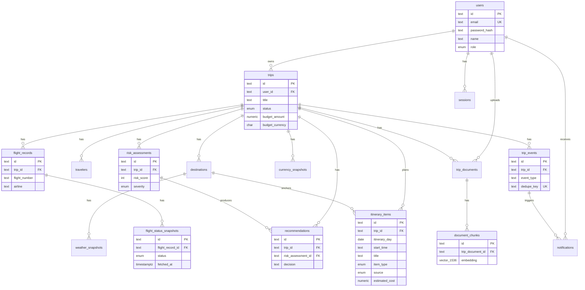

# TripOS — Database

## Status: Phase 3 (Database Architecture) Complete — schema additions since then are documented inline (Phases 14, 19, 20)

Source of truth for the schema is `prisma/schema.prisma`. This document
explains the design and, importantly, how it was actually verified.

## A note on verification methodology

`prisma generate` / `migrate` / `validate` could not be run in the sandbox
this was built in. Prisma's CLI fetches a schema-engine binary from
`binaries.prisma.sh` at runtime — confirmed on both Prisma 7 and Prisma 6,
so this isn't a version quirk — and that domain isn't in this sandbox's
network allowlist (the same restriction that blocks the travel provider
APIs; see `docs/BUILD_PROGRESS.md` Phase 0).

This is a **sandbox-only** limitation. Any normal dev machine, GitHub
Actions runner, or Docker build has standard internet access and will run
`pnpm db:generate` / `pnpm db:migrate` normally.

To still verify the actual relational design for real rather than writing
it on faith, the schema was hand-translated into equivalent DDL and
applied directly to a live local PostgreSQL 16 + pgvector 0.6.0 instance
(installed in-sandbox via `apt`, from the allowed Ubuntu mirrors — no
external network dependency). That verification covered:

- All 17 tables, 8 enum types, and every index created without error.
- A full realistic insert chain: user → trip → destination → flight
  record → two append-only flight status snapshots → weather snapshot →
  currency snapshot → document → document chunk (with a real 1536-dimension
  vector, not a stub) → risk assessment → recommendation → trip event.
- The `trip_events.dedupe_key` unique constraint **correctly rejected** a
  duplicate insert — proving the idempotency design in
  `docs/ARCHITECTURE.md` Section 9 actually holds at the database level,
  not just on paper.
- A real pgvector cosine-distance similarity query (`<=>` operator) against
  the HNSW index, which executed and returned a result.
- `ON DELETE CASCADE`: deleting a trip correctly removed every dependent
  row (destinations, flights, snapshots, documents, chunks, risk
  assessments, recommendations, events) while leaving the owning user
  intact.

`prisma/seed.ts` is written against the real Prisma Client API (the
correct, intended path for any environment where `prisma generate` can
run) but was not itself executed end-to-end here, since it depends on
client generation. The equivalent data shape it produces **was** verified
via the raw SQL pass above.

## Entity-Relationship Diagram


```mermaid
erDiagram
    users ||--o{ trips : owns
    users ||--o{ sessions : has
    users ||--o{ trip_documents : uploads
    users ||--o{ notifications : receives

    trips ||--o{ travelers : has
    trips ||--o{ destinations : has
    trips ||--o{ flight_records : has
    trips ||--o{ currency_snapshots : has
    trips ||--o{ trip_documents : has
    trips ||--o{ risk_assessments : has
    trips ||--o{ recommendations : has
    trips ||--o{ trip_events : has
    trips ||--o{ itinerary_items : plans

    destinations ||--o{ weather_snapshots : has
    destinations ||--o{ itinerary_items : anchors
    flight_records ||--o{ flight_status_snapshots : has
    trip_documents ||--o{ document_chunks : has
    risk_assessments ||--o{ recommendations : produces
    trip_events ||--o{ notifications : triggers

    users {
        text id PK
        text email UK
        text password_hash
        text name
        enum role
    }
    trips {
        text id PK
        text user_id FK
        text title
        enum status
        numeric budget_amount
        char budget_currency
    }
    itinerary_items {
        text id PK
        text trip_id FK
        date itinerary_day
        text start_time
        text title
        enum item_type
        enum source
        numeric estimated_cost
    }
    flight_records {
        text id PK
        text trip_id FK
        text flight_number
        text airline
    }
    flight_status_snapshots {
        text id PK
        text flight_record_id FK
        enum status
        timestamptz fetched_at
    }
    document_chunks {
        text id PK
        text trip_document_id FK
        vector_1536 embedding
    }
    risk_assessments {
        text id PK
        text trip_id FK
        int risk_score
        enum severity
    }
    recommendations {
        text id PK
        text trip_id FK
        text risk_assessment_id FK
        text decision
    }
    trip_events {
        text id PK
        text trip_id FK
        text event_type
        text dedupe_key UK
    }
```

`audit_logs` and `api_health` are intentionally standalone (not
FK-linked): audit entries reference arbitrary entity types polymorphically
by `(entity_type, entity_id)` rather than a single foreign key, and
`api_health` tracks providers, not domain entities.

**Reading `audit_logs` without FKs (Phase 24).** Because no join to
`trips` exists, ownership can never be re-derived from an audit row.
Both readers are handed trip ids the trip module already verified:
`listAuditLogsForTrips` matches on `metadata->>'tripId'` or the trip
being the entity, and `listAuditLogsForUser` additionally matches the
caller's own `USER` rows by `actor_id` (and `metadata->>'userId'`), so
account-level actions that name no trip still appear on the user's own
stream. The `ActorType` cast is explicit (`::"ActorType"`) on every
write and filter, per the raw-SQL enum rule.

## Design decisions worth explaining

**Append-only snapshot tables, not mutable status columns.**
`flight_status_snapshots`, `weather_snapshots`, and `currency_snapshots`
never update a row in place — every check inserts a new row. This is what
makes "compare current state against previous snapshot" (Phase 10) and
"only meaningful changes generate alerts" (Phase 19) possible: the
comparison reads the latest two rows rather than diffing against a value
that's already been overwritten.

**`flight_status_snapshots` and `sessions` are justified additions**
beyond the brief's starting entity list — both explained inline in
`schema.prisma` where they're defined, and both directly required by
behavior specified elsewhere in the brief (state comparison for the
Flight Agent; server-side session revocation for the auth flow).

**`itinerary_items.itinerary_day` is a `date`, read back as text.**
"Day 2 of the trip" is a calendar day on the traveler's itinerary, not
an instant: storing it as `timestamptz` would let rendering shift it a
day in another timezone, and letting node-postgres parse `date` into a
JS `Date` has the same hazard in server-local time. The repository
casts `itinerary_day::text` on every read and compares `'YYYY-MM-DD'`
strings, so what was written is what comes back (Phase 20).

**Costs and their currency travel together, and so do a budget's amount
and currency.** Two CHECK constraints (`itinerary_items_cost_currency_together`,
`trips_budget_pair_check`) enforce what the application also validates:
a cost with no currency is uninterpretable, and a half-set budget cap
would make "is this trip over budget?" unanswerable. Neither can be
expressed in `prisma/schema.prisma`, same situation as
`trip_watches_interval_bounds`.

**`source` (`USER` / `AI_PLANNER`) is the column that keeps regeneration
safe.** A re-plan deletes the trip's previous AI rows in one transaction
and leaves `USER` rows alone; without it, "regenerate itinerary" would
be indistinguishable from "overwrite everything the traveler typed".

**Sessions, not the full Auth.js/NextAuth adapter schema.** The official
Prisma adapter's `Account` and `VerificationToken` models exist for OAuth
and email-link providers. TripOS is credentials-only (see
`docs/ARCHITECTURE.md` Section 12), so those two tables would sit
permanently empty. A minimal `sessions` table gives the same
database-backed revocability with less unused surface area — and stores a
**hash** of the session token, not the token itself, the same principle
as password hashing: never keep a live secret in plaintext, even
server-side, even in your own database.

**`event_type` is a string, not a Postgres enum.** `TripStatus`,
`FlightStatus`, `DocumentStatus`, `RiskSeverity`, `RecommendationStatus`,
`ActorType`, and `ApiHealthStatus` are all proper Postgres enums because
those sets are small and stable. Event types are expected to grow across
many future phases (Phases 18–20 alone name eight, and more will likely
follow) — a string column validated at the application layer avoids a
schema migration every time a new one is added.

**JSONB for semi-structured data**, used deliberately in exactly four
places: `trip_documents.extracted_metadata` (varies by document type —
not every document has a booking reference or passenger name),
`risk_assessments.factors`/`evidence`, and `recommendations.evidence` (the
explainable-AI evidence structure varies by what kind of recommendation
it is). Everything else is a normal typed column — this is not a
"JSONB everywhere" schema.

**`trip_documents.extracted_text` (added Phase 14)** is a plain `text`
column on purpose: the extracted body is document content, not metadata,
so it does not belong in the JSONB field above. It is also deliberately
absent from the summary `SELECT` used by the digital twin and document
list — bodies can be megabytes and those paths never need them. Phase 15
chunking reads it directly instead of re-parsing originals.

**Numeric types**: `Decimal`, not `Float`, for anything money- or
rate-like (`currency_snapshots.rate`, `risk_assessments.confidence`,
`recommendations.confidence`) to avoid floating-point rounding errors.
`risk_score` is a plain `Int` (0–100 by convention, enforced at the
application layer in Phase 16, not a DB constraint yet — noted as a
known gap below).

**`document_chunks.embedding` is `vector(1024)`** — decided in Phase 15.
The earlier `vector(1536)` was explicitly provisional pending an embedding
model choice, and that choice is now made: Voyage AI's `voyage-3` model
emits 1024-dimension vectors. Anthropic has no embeddings endpoint at all,
so a separate provider was always required. The dimension is enforced by
Postgres, not TypeScript, so `EMBEDDING_DIMENSIONS` in
`src/integrations/embeddings/provider.ts` and this column must be changed
together.

**pgvector is now a hard requirement, and it is a real one.** Phase 15
builds the extension from source in this environment (it is not packaged
for the local Postgres 14) and applies it to both local databases:

```sql
CREATE EXTENSION IF NOT EXISTS vector;
ALTER TABLE document_chunks
  ALTER COLUMN embedding TYPE vector(1024);
CREATE INDEX document_chunks_embedding_idx
  ON document_chunks USING hnsw (embedding vector_cosine_ops);
```

The HNSW index is created with raw SQL rather than declared in
`schema.prisma` on purpose: Prisma's vector-index support could not be
validated in this environment, and committing schema syntax that was
never executed would trade a real check for a cosmetic one. The note above
about this environment materializing DDL by hand applies here too.

**Passport numbers** (`travelers.passport_number`) are stored as plain
text for now. This is flagged, not silently accepted: real passport data
needs encryption-at-rest and access auditing before this schema should
hold anything real. Tracked as a Phase 4 (Security Foundation) item.

### Phase 19 — `trip_watches` (Trip Watch scheduling)

One row per watched trip, created by
`modules/monitor/watch-service.ts`. Committed as executable DDL in
`prisma/sql/phase-19-trip-watch.sql` and applied by hand to both the dev
and test databases, exactly as Phase 3's original schema was:

```sql
CREATE TABLE trip_watches (
  id                text PRIMARY KEY DEFAULT gen_random_uuid()::text,
  trip_id           text NOT NULL UNIQUE REFERENCES trips (id) ON DELETE CASCADE,
  enabled           boolean NOT NULL DEFAULT true,
  interval_minutes  integer NOT NULL DEFAULT 60,
  alert_min_severity "RiskSeverity" NOT NULL DEFAULT 'MEDIUM',
  last_run_at       timestamptz,
  last_error        text,
  next_run_at       timestamptz NOT NULL DEFAULT now(),
  created_at        timestamptz NOT NULL DEFAULT now(),
  updated_at        timestamptz NOT NULL DEFAULT now(),
  CONSTRAINT trip_watches_interval_bounds CHECK (interval_minutes BETWEEN 5 AND 1440)
);
CREATE INDEX trip_watches_due_idx ON trip_watches (enabled, next_run_at);
```

Design notes worth recording:

- **Why a table and not columns on `trips`.** This is state about the
  _watching_, not about the trip, and an unwatched trip simply has no row
  — no nullable "is it watched" column whose NULL has to be interpreted.
  It cascades with the trip, so deleting a trip cannot orphan a
  scheduler entry.
- **`next_run_at` is the scheduler's whole memory**, and it is written by
  Postgres (`now()`), never by the Node process. The sweep's due-ness
  comparisons stay inside SQL for the same reason — see Section 21 of
  `docs/ARCHITECTURE.md` for the microsecond-truncation bug that made
  this a requirement rather than a preference.
- **The CHECK constraint is deliberate and is the one exception** to this
  schema's "range validation lives in the application" habit. A cadence
  of 0 or a negative number schedules a tight loop of _paid_ provider
  calls, so it is worth a constraint no application path can bypass. The
  cost is stated below.

## Known gaps (honest, not hidden)

- **Raw SQL against enum columns needs an explicit cast** (e.g.
  `'DEGRADED'::"ApiHealthStatus"`) — Postgres's type inference can fail on
  an unquoted-type string literal inside a `CASE` expression combined with
  `ON CONFLICT ... DO UPDATE`. Found via a real Postgres test failure in
  Phase 6 (`api-health-repository.ts`), not by inspection — see
  `docs/INTEGRATIONS.md`'s resilience section for the full story. Every
  future repository touching an enum column (Trip, Flight, Document,
  Risk, Recommendation all have one) should cast explicitly from the
  start.

- No DB-level `CHECK` constraint on `risk_score` (0–100) or `confidence`
  (0.00–1.00) yet — validated at the application layer only so far.
  Worth adding as a `CHECK` constraint when Phase 16 firms up the exact
  bounds.
- No composite uniqueness constraint preventing duplicate
  `(flight_record_id, fetched_at)` snapshots if a job runs twice in the
  same instant — acceptable for now since Phase 19's idempotency lives at
  the event layer (`trip_events.dedupe_key`), not the snapshot layer, but
  worth revisiting if duplicate snapshots turn out to matter.
- Migration history: since `prisma migrate dev` couldn't run here, no
  `prisma/migrations/` directory exists yet. The first real migration
  will be generated the first time this runs in an environment with
  normal internet access.
- `trip_watches`'s `CHECK (interval_minutes BETWEEN 5 AND 1440)` cannot be
  expressed in `prisma/schema.prisma`, so a migration generated from the
  schema alone would recreate the table without it. The service validates
  the same bounds, so behaviour stays correct either way — but the extra
  database-level guarantee would need re-adding by hand. Noted here
  rather than assumed away.
- Same for Phase 20's three itinerary/budget CHECKs (`time format`,
  `cost ↔ currency pair`, `budget pair + positive`) and its
  `itinerary_items (trip_id, itinerary_day, start_time)` index: the index
  is expressible in the schema, the checks are not. The DDL actually
  executed is committed verbatim as `prisma/sql/phase-20-itinerary-planner.sql`.
